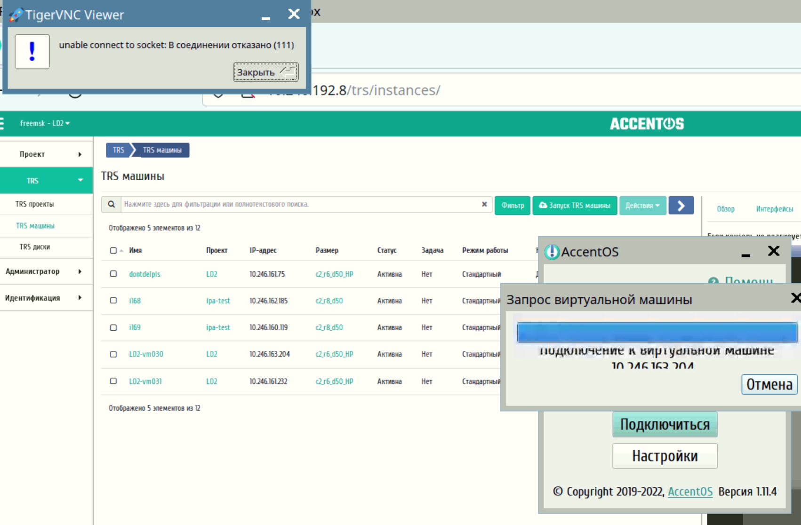

- **Инцидент**: 

    - **Дата**: 

    - **Источник**: 

    - **Причины**: 
    
    - **Решение**: 

    - **Обнаружил**: Р. Шафиков

    - **Решил**: Р. Шафиков, И. Аминов

***

<br/>

# Ошибки в ПО и его настройке со стороны РЖД

- **Инцидент**: Гостевая ВМ не входит в домен FreeIPA

    - **Дата**: 01.04.2022

    - **Источник**: Гостевая ВМ, FreeIPA

    - **Причины**: Некорретные DNS на виртуальной машине
    
    - **Решение**: 
    
        1. Проверить корректность настройки DNS сети Openstack

        2. Проверить резолвинг через `nslookup`

        3. Проверить через утилиту `ldapsearch` получение учетной записи для ввода в домен

        4. Сравнить настройки keystone с конфигурацией ввода в домен

    - **Обнаружил**: Р. Шафиков

    - **Решил**: Р. Шафиков, И. Аминов

***

# Ошибки в ПО и его настройке со стороны ТехноПром

***

# Ошибки в ПО и его настройке с нашей стороны

***

- **Инцидент**: Образ виртуальной машины не загружается через Дашборд

    - **Дата**: 14.02.2022

    - **Источник**: OpenStack.Dashboard

    - **Причины**: неизвестно 
    
    - **Решение**: загрузить через консоль в Glance напрямую
        
        ```sh
        # Заходим на контроллер, активируем окружение и выполняем команду
        glance image-create --name "test_name" --file test_image.qcow2 --disk-format qcow2 --container-format bare --visibility=public
        ```

    - **Обнаружил**: Р. Шафиков

    - **Решил**: Р. Шафиков

    - **Изображение**: Скриншот ошибки

        

***

- **Инцидент**: при подключении через RS-client возникает 500 ошибка "500 internal server error"

    - **Дата**: 15.02.2022

    - **Источник**: RS-client, WebGard

    - **Причины**: упал Haproxy / упал Patroni / кончилась память / проблемы с БД

    - **Решение**: `journalctl -r` на ВГ, удаление логов/добавление диска, отладка patroni, отладка Haproxy, изменение уровня логирования

        ```sh
        # на ВГ выполнить следующие команды
        patronictl -c /etc/patroni1.yml list
        ETCDCTL_API=3 etcdctl endpoint status --cluster -w table
        ```

    - **Обнаружил**: Р. Шафиков

    - **Решил**: Р. Шафиков, И. Аминов

***

- **Инцидент**: при подключении через RS-client возникает 404 ошибка "404 Not Found"

    - **Дата**: 31.03.2022

    - **Источник**: RS-client, WebGard

    - **Причины**: Неверный конфиг WebGard
    
    - **Решение**: 
        ```sh
        # указать корректный порт для службы http-webguard_ad_rs - 9365
        nano wgad/etc/http-webguard/http-webguard-rs.conf
        systemctl restart http-webguard_ad_rs.service
        ```

    - **Обнаружил**: Р. Шафиков

    - **Решил**: Р. Шафиков, И. Аминов

***

- Инцидент: Образ виртуальной машины большого размера (30+гб) и не успевает загрузиться за время браузерной сессии.

    - **Причины**: Зависит от окружающий условий: малая скорость локальной сети, короткий тайм-аут на веб-сессию и т.п.; 
    
    - **Решение**: загрузить через консоль в Glance напрямую. Загрузить образ на любую ВМ с клиентом openstack и выполнить команду по примеру ниже;
    
    - **Обнаружил**: Д. Кремененко

    - **Решил**: Д. Кремененко
        
        Пример команды:       
        ```
        glance image-create --name "test_name" --file test_image.qcow2 --disk-format qcow2 --container-format bare --visibility=public
        ```      

***

- Инцидент: при снятии снимка ВМ зависает "Запланирован" больше, чем на 30 минут, в то время как используемая для этого ВМ свободна к использованию.

    - **Причины**: Неизвестно;
    
    - **Решение**: Убедиться, что ВМ, с которой начали делать снимок готова к использованию (статус "Активна", "Отключена". Задача - "Нет"). Удалить снимок со статусом "Запланирован". Запустиьть процесс создания снимка заново;

    - **Обнаружил**: Д. Кремененко;

    - **Решил**: Д. Кремененко;

***

- Инцидент: При успешной загрузке образа в формате .ova, он отображается в Dashboard как формат .vmdk.

    - **Причины**: Так и должно быть. Система раскрывает .ova и достаёт оттуда данные для .vmdk; 
    
    - **Решение**: Ничего делать не надо;

    - **Обнаружил**: Д. Кремененко;

    - **Решил**: Д. Кремененко;


***

- Инцидент: Не работает проброс вебкамеры на Windows 10 на гостевую ВМ.

    - **Причины**: Не настроен проброс в RDP config file, не настроена локальная политика безопасности, мешает Касперский; 
    
    - **Решение**: Выключить Касперский на всём маршруте (ТК-ВМ) и проверить проброс снова, проверить настройки локальных политик, проверить настройку конфиг файла для RDP;

    - **Обнаружил**: Д. Кремененко;

    - **Решил**: Д. Кремененко;

        [Ссылка](http://10.40.129.18/1.12.1.dev9/ru/tech_docs_knowledge_base/knowledge_base/linux/freerdp.html?#id8) на настройки локальных политик безопасности

        Для rdp config убедиться, что есть параметр:
        ```
        camerastoredirect:s:*
        ```      

***

- Инцидент: Некорректное поведение мыши в консоли SPICE вирутальной машины Windows 10 (рассинхронизирована с поведением реальной).

    - **Причины**: В образе отсутствует Qemu-guest-agent;
    
    - **Решение**: [Установить](https://pve.proxmox.com/wiki/Qemu-guest-agent). Убедиться, что в входит в состав золотого образа;

    - **Обнаружил**: Д. Кремененко;

    - **Решил**: Д. Кремененко;


***

- Инцидент: При инициализации ВМ Windows 10 машина не отрабаывает скрипты из раздела "Конфигурация" или не меняет hostname на актуальный.

    - **Причины**: Отсутствует/не отработал пакет Cloudbase Solutions. Конкретная **Причины** такого поведения может быть различная.
    
    - **Решение**: [Переустановить](https://cloudbase.it/cloudbase-init/#download). Cloudbase Solutions непосредственно при подготовке золотого образа. Для Windows 10 можно руководствоваться [инструкцией](https://handbook.tionix.ru/BIBLIO/TCP_2.9/Imaging/03_Sysprep.html). Подготавливать образ можно по рецепту без sysprep.  

    - **Обнаружил**: Д. Кремененко;

    - **Решил**: Д. Кремененко;

***

- Инцидент: При создании одновременно нескольких ВМ из конкретного образа в первый раз машины долго создаются, а потом уходят в ошибку. 

    - **Причины**: BootBurst. 
    
    - **Решение**: Если из образа ещё не создавалась ни одна ВМ, то следует сначала создать одну виртуальную машину и дождаться её полного запуска.

    - **Обнаружил**: Д. Кремененко, Р. Шафиков;

***

- Инцидент: TRS-проект недоступен для создания ВМ с причиной "Тип инстанса недоступен" в то время как инстанс существует и доступен.

    - **Причины**: Вероятно, что в проекте нет администратора домена или лица, которое создавало этот инстанс. 
    
    - **Решение**: Убедиться, что в TRS-проекте в участникахх есть администратор домена/создатель инстанса.

    - **Обнаружил**: Д. Кремененко;
    
    - **Решил**: Д. Кремененко;   

***

- Инцидент: При прохождении ПМИ на отказоустройчивость пропал доступ до WebGuard. 

    - **Причины**: Выяснилось, что 2 из 3х ВГ были на одном вычислительном узле, на котором проводилась проверка на отказоустойчивость;
    
    - **Решение**: Перед испытаниями по ПМИ проверять, что каждая из ВМ-WebGuard находится на отдельном ВУ. 

    - **Обнаружил**: Д. Кремененко;
    
    - **Решил**: Д. Кремененко;  

***

- **Инцидент**: При подключении через RS-client VNC выдает ошибку "111: Cant bind socket"

    - **Дата**: 12.09.2022

    - **Источник**: RS-client, Гостевая ВМ

    - **Причины**: некорретный сбор образа
    
    - **Решение**: 
        ```sh
        # на Гостевой ВМ, с которой планируется снимать образ:
        sed -i '/PasswordAuthentication/Id' /etc/ssh/sshd_config
        sed -i '/ChallengeResponseAuthentication/Id' /etc/ssh/sshd_config
        sed -i '/Match User/Id' /etc/ssh/sshd_config
        ```

    - **Обнаружил**: Р. Шафиков

    - **Решил**: Р. Шафиков, И. Аминов

    - **Изображение**: Скриншот ошибки

        

***

- **Инцидент**: На Вебке WebGard не работает /logout, редиректит на несуществующую страницу

    - **Дата**: 08.04.2022

    - **Источник**: WebGard

    - **Причины**: Данный URL вшит, чтобы пофиксить необходимо менять настройки WebGard
    
    - **Решение**: 

        в http-webguard.conf, в локейшн /auth/login/ нужно добавить:
        "proxy_guard_login_location /auth_wg/login:

    - **Обнаружил**: Р. Шафиков

    - **Решил**: И. Аминов

***

- **Инцидент**: Ввод в домен FreeIPA осуществляется более нескольких минут

    - **Дата**: 22.08.2022

    - **Источник**: Гостевая ВМ, FreeIPA

    - **Причины**: Домены для ввода машины перебираются в произвольном порядке
    
    - **Решение**: Необходимо указать конкретный домен для ввода, используя следующий пример команды:

        ```sh
        astra-freeipa-client -u msk_virazh_admin -p 1qazXSW@3eda --par "--domain crp.rzd --server dc1-msk.crp.rzd --server dc2-msk.crp.rzd" -y
        ```

    - **Обнаружил**: Р. Шафиков

    - **Решил**: Р. Шафиков, А. Виноградов

***

25 april