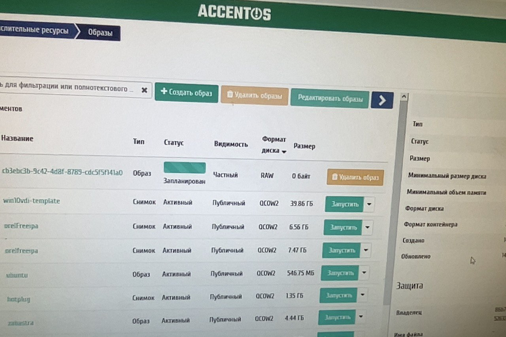

Суть задачи: Необходимо выбрать из доступных источников информации все возникавшие по проекту проблемы. Произвести из группировку по направлениям:
административные (не заказали пропуск, не пустили, не знаю с кем обсуждать, зачем я тут и т.п.);
ошибки в ПО и его настройке с нашей стороны;
ошибки в ПО и его настройке со стороны Технопром;
ошибки в ПО и его настройке со стороны РЖД;
иное.
Каждый инцидент необходимо описать (когда, где, что не работает, как проявляется, кто нашёл решение, ссылка на решение) в таблице. Переписку из чатов (почта, ссылки и т.п.) копировать в таблицу + скрины (именовать скрины по номеру инцидента).
Для чего будет использоваться (поможет при сборе и оформлении доказательной базы):
1. Будем проводить цикл встреч и искать пути по предотвращению и недопущению;
2. Документальное подтверждение на переговорах. Важно дать нашим коллегам аргументы, факты и иные рычаги воздействия, которые в дальнейшем создадут для нас же комфортные условия работы с заказчиками.

- **Инцидент**: 

    - **Дата**: 

    - **Источник**: 

    - **Причина**: 
    
    - **Решение**: 

    - **Обнаружил**: Р. Шафиков

    - **Решил**: Р. Шафиков, И. Аминов

    - **Изображение**: 

***

<br/>

# ошибки в ПО и его настройке с нашей стороны

***

- **Инцидент**: Образ виртуальной машины не загружается через Дашборд

    - **Дата**: 14.02.2022

    - **Источник**: OpenStack.Dashboard

    - **Причина**: неизвестно 
    
    - **Решение**: загрузить через консоль в Glance напрямую
        
        ```sh
        # Заходим на контроллер, активируем окружение и выполняем команду
        glance image-create --name "test_name" --file test_image.qcow2 --disk-format qcow2 --container-format bare --visibility=public
        ```

    - **Обнаружил**: Р. Шафиков

    - **Решил**: Р. Шафиков

    - **Изображение**: Скриншот ошибки

        

***

- **Инцидент**: при подключении через RS-client возникает 500 ошибка "500 internal server error"

    - **Дата**: 15.02.2022

    - **Источник**: RS-client, WebGard

    - **Причина**: упал Haproxy / упал Patroni / кончилась память / проблемы с БД

        ```sh
        # на ВГ выполнить следующие команды
        patronictl -c /etc/patroni1.yml list
        ETCDCTL_API=3 etcdctl endpoint status --cluster -w table
        ```

    - **Решение**: `journalctl -r` на ВГ, удаление логов/добавление диска, отладка patroni, отладка Haproxy, изменение уровня логирования

    - **Обнаружил**: Р. Шафиков

    - **Решил**: Р. Шафиков, И. Аминов

    - **Изображение**: 

***

- **Инцидент**: при подключении через RS-client возникает 404 ошибка "404 Not Found"

    - **Дата**: 31.03.2022

    - **Источник**: RS-client, WebGard

    - **Причина**: Неверный конфиг WebGard
    
    - **Решение**: 
        ```sh
        # указать корректный порт для службы 9365
        nano wgad/etc/http-webguard/http-webguard-rs.conf
        systemctl restart http-webguard_ad_rs.service
        ```

    - **Обнаружил**: Р. Шафиков

    - **Решил**: Р. Шафиков, И. Аминов

    - **Изображение**: 

***

- **Инцидент**: 

    - **Дата**: 

    - **Источник**: 

    - **Причина**: 
    
    - **Решение**: 

    - **Обнаружил**: Р. Шафиков

    - **Решил**: Р. Шафиков, И. Аминов

    - **Изображение**: 

***